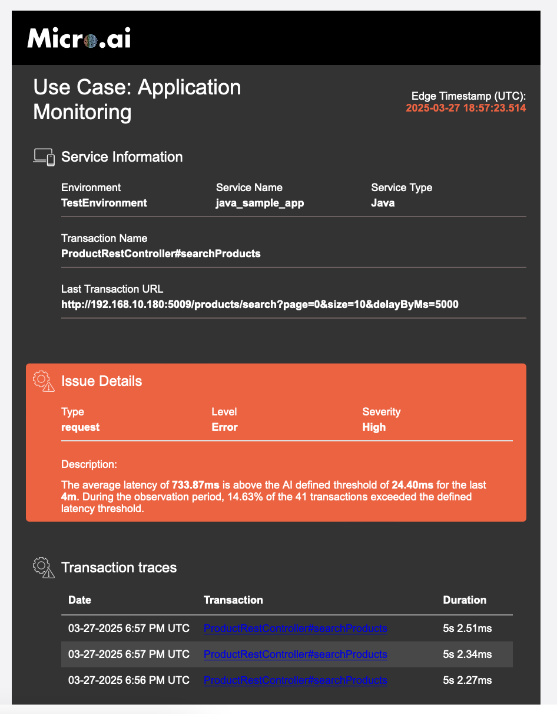
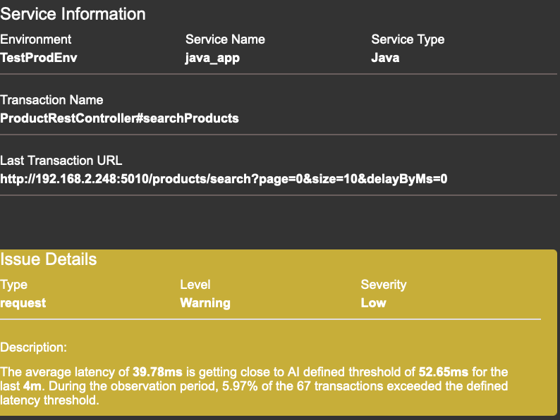
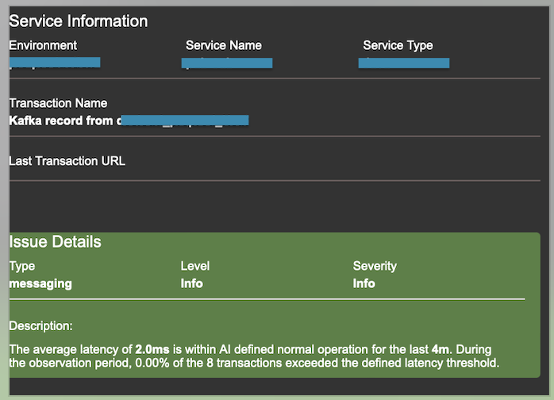

# Configurations
The following options allows you to configure your agent according to your needs. Updating this requires the agent to be restarted, and in some cases, retraining.

The configuration file is done from environment variables. 
## Table of Contents

- [Default configurations](#default-configurations)
- [Enabling Email Alerts](#enabling-email-alerts-for-security-events)
- [Exporter Configurations](#exporter-configurations)
- [Configure URL and Port Monitoring](#configure-url-and-port-monitoring)
- [All Configurations](#all-configuration-options)
- [Prometheus Configuration](##Connect-Integrated-Prometheus-Exporter-with-Prometheus-Server)

## Default configurations

Understanding the environment variables and their effect on agent.

- <ins>MICROAI_AM_ENABLE_AGENT</ins> - (Boolean value) Enables/Disables agent. Default behavior is disable if value not set
- <ins>MICROAI_AM_ENVIRONMENT</ins> - (String value) Environment of the application where it is running
- <ins>MICROAI_AM_PROFILE_KEY</ins> - (String value) MicroAI Launchpad profile key
- <ins>MICROAI_AM_TRAINING_ROWS</ins> - (Integer value) Number of call/transaction per API to use for training
- <ins>MICROAI_AM_IS_BUILD_MODEL</ins> - (Boolean value)Use existing model if exists if value is set as true otherwise it will override the model with new training dataset. Best to set false in containerized environment.
- <ins>MICROAI_AM_OBSERVATION_WINDOW_MINUTES</ins> - (Integer value) Sliding Window duration to take in count when alerting on performance
- <ins>MICROAI_AM_EMAIL_HOST</ins> - (String value) Email host value used for sending email alerts
- <ins>MICROAI_AM_EMAIL_PORT</ins> - (String value) Email port value used for sending email alerts
- <ins>MICROAI_AM_EMAIL_USERNAME</ins> - (String value) Email username value used for sending email alerts
- <ins>MICROAI_AM_EMAIL_PASSWORD</ins> - (String value) Email password value used for sending email alerts
- <ins>MICROAI_AM_EMAIL_FROM</ins> - (String value) Sender Email used for sending email alerts
- <ins>MICROAI_AM_EMAIL_TO</ins> - (String - Support comma separated) Receiver's Email used for sending email alerts
- <ins>MICROAI_AM_EMAIL_TRANSACTION_BASE_URL</ins> - Used for Internal Launchpad - (String value) Use for linking email links to Launchpad
- <ins>MICROAI_AM_EMAIL_ICONS_BASE_URL</ins> - Used for Internal Launchpad - (String value) - Use for displaying icons in email alert
- <ins>MICROAI_AM_MQTT_HOST</ins> - Used for Internal Launchpad - (String value) - Use for sending data to Launchpad for Dashboard and Alerts
- <ins>MICROAI_AM_MQTT_PORT</ins> - Used for Internal Launchpad - (String value) - Use for sending data to Launchpad for Dashboard and Alerts
- <ins>MICROAI_AM_MQTT_USERNAME</ins> - Used for Internal Launchpad - (String value) - Use for sending data to Launchpad for Dashboard and Alerts
- <ins>MICROAI_AM_MQTT_PASSWORD</ins> - Used for Internal Launchpad - (String value) - Use for sending data to Launchpad for Dashboard and Alerts
- <ins>MICROAI_AM_FEED_INFO_BASE_URL</ins> - Used for Internal Launchpad - (String value) - Use for activating Agent with Launchpad
- <ins>MICROAI_AM_ALERT_MODIFIER</ins> - (Float value) Used for controlling AI Alert detection sensitivity 
## Enabling Email Alerts for Security Events

The Email Notification Exporter enables the system to send automated email alerts based on predefined security events. Users can configure SMTP settings to integrate with their email servers and specify alert severity levels to control which notifications are sent. Alerts can be filtered based on severity levels ranging from Critical to Informational, ensuring that users receive only the most relevant notifications.

```json
{
  // ... other fields ...
  "Email_Notification_Exporter": {
    "smtp_host": "",
    "smtp_port": 587,
    "smtp_username": "",
    "smtp_password": "",
    "smtp_from_emailid": "",
    "smtp_to_email_list": "",
    "smtp_severity": "Critical, High"
  }
  // ... other fields ...
}
```
To enable email notifications, the system requires SMTP (Simple Mail Transfer Protocol) configuration. The following parameters must be defined:

### SMTP Configuration Parameters

- **`smtp_host`**: Specifies the SMTP server address that will handle outgoing emails.  
  *Example:* `smtp.mailserver.com`
- **`smtp_port`**: Defines the port used for SMTP communication. Common values include:
  - `587` (TLS encryption)
  - `465` (SSL encryption)
  - `25` (Unencrypted)
- **`smtp_username`**: The email address used to authenticate with the SMTP server.  
  *Example:* `admin@mailserver.com`
- **`smtp_password`**: The password associated with the SMTP username for authentication.

### Email Notification Details

The following parameters define how email notifications are sent and received:

- **`smtp_from_emailid`**: The sender's email address displayed in outgoing alerts.  
  *Example:* `alertsFrom@mailserver.com`
- **`smtp_to_email_list`**: A comma-separated list of recipient email addresses that should receive alerts.  
  *Example:* `it_team@mailserver.com,support@mailserver.com`

### Alert Severity Control

Users can customize email notifications based on the severity of alerts, ensuring that only relevant notifications are received. The `smtp_severity` parameter defines the severity levels of notifications to be sent. The available options are:

- **Critical** – Indicates urgent security threats that require immediate action.
- **High** – Represents significant security events that may impact system performance.
- **Medium** – Covers moderate security warnings that should be reviewed.
- **Low** – Includes minor alerts that may not require immediate attention.
- **Info** – Provides general system activity updates.

### Email Notification Alerts

To help users recognize MicroAI security alerts, below are sample screenshots of email notifications:

#### Critical or High APM Alert

The following screenshot shows a **Critical APM Alert** email from MicroAI, indicating a set of transactions has been detected as abnormal for the configured duration. It includes service details such as environment, service name, service type, transaction name, and Last URL, along with issue details like type, level, and severity




#### Medium or Low APM Alert

The following screenshot shows a **Low APM Alert** email from MicroAI, indicating a set of transactions has been detected as abnormal for the configured duration. It includes service details such as environment, service name, service type, transaction name, and Last URL, along with issue details like type, level, and severity


#### Informational Monitoring Alert

The following screenshot displays an **Informational APM Alert** from MicroAI, indicating an active alert for the given environment, service, and endpoint has recovered.



## Exporter Configurations

MicroAI supports various exporters to forward security events to remote systems. Users can configure these exporters based on their infrastructure:

```json
{
  // ... other fields ...
    "LaunchpadExporter": {
        "Enabled": false //enabling this requires Launchpad account
    },
    "ExternalExporter": {
        "ExternalExporterType": "off", //either http, redis or mqtt
        "Https_Post_Endpoint": "",
        "Output_Redis_Endpoint": "",
        "Output_MQTT": {
        "Endpoint": "127.0.0.1",
        "Port": 1884,
        "Username": "",
        "Password": "",
        "topic_prefix": "data/"
        }
    },
  // ... other fields ...
}
```

- **Launchpad Exporter:** Enabled to transmit data to Launchpad, this default exporter ensures you receive all security & monitoring data, including alerts, directly from the endpoint.
- **HTTP Exporter:** This exporter sends all data, including synchronous and asynchronous information, to a specified HTTP endpoint. It forwards comprehensive event data, enabling users to integrate with custom web applications, security information and event management (SIEM) systems, or other HTTP-based services. This ensures that both real-time and historical data can be transferred seamlessly across systems.
- **MQTT Exporter:** For systems utilizing MQTT messaging protocols, this exporter publishes all data, including both synchronous and asynchronous content, to an MQTT broker. This allows for the transmission of comprehensive event data. This method is ideal for lightweight, real-time messaging and is particularly well-suited for IoT-based applications and cloud-native systems that rely on MQTT for communication, enabling efficient data distribution across these environments.
- **Redis Exporter:** The Redis exporter pushes all data, including both synchronous and asynchronous information, into a Redis queue. Offering the flexibility to send complete event data. This is particularly useful for applications that require fast access to event data or for integrating with other Redis-based systems, like job queues or message brokers, ensuring efficient message handling and storage in high-throughput environments.
- **Built-in Prometheus metrics endpoint:** MicroAI APM includes a built-in Prometheus metrics endpoint to provide real-time system monitoring and health diagnostics. The endpoint, accessible via http://127.0.0.1:9100/metrics, exposes key system telemetry in a Prometheus-compatible format, allowing integration with monitoring and alerting systems. This is always enabled.


## All Configuration options

All available configurable options available in the config file is provided below. You will need to restart the agent for these changes to take effect.

| Category                        | Parameter                 | Value                             | Description                                      |
| ------------------------------- | ------------------------- | --------------------------------- | ------------------------------------------------ |
| **Y Code**                      | Mode                      | 0                                 | Determines if Continuous (0) or Storage (1) mode |
|                                 | OutputLocation            | 127.0.0.1:5005                    |                                                  |
| **Mode Continuous**             | Sync_freq                 | 5000                              | Rate at which sync messages are sent (ms)        |
|                                 | Max_async_freq            | 1000                              | Max rate at which async messages are sent (ms)   |
| **Mode Storage**                | Max_Rows                  | 50                                | Number of stored messages before triggering.     |
|                                 | Max_Secs                  | 600                               | Maximum age of stored messages.                  |
|                                 | Post_Event_Send_Time_secs | 600                               | Duration of continuous mode after trigger.       |
|                                 | Sync_freq                 | 5000                              | Frequency of sync packet generation.             |
|                                 | Max_async_freq            | 1000                              | Max async packet generation frequency.           |
| **Launchpad Exporter**          | Enabled                   | true/false                        | Enable sending data to Launchpad.                |
| **External Exporter**           | ExternalExporterType      | Off/HTTP/MQTT/REDIS               | Specify one of these options                     |
|                                 | Https_Post_Endpoint       | https://your.site/endpoint        |                                                  |
|                                 | Output_Redis_Endpoint     | 192.168.2.171:6379                |                                                  |
|                                 | Output_MQTT_Endpoint      | 127.0.0.1                         |                                                  |
|                                 | Output_MQTT_Port          | 1884                              |                                                  |
|                                 | Output_MQTT_Username      | Example: user                     |                                                  |
|                                 | Output_MQTT_Password      | Example: password@123             |                                                  |
|                                 | Output_MQTT_topic_prefix  | data/                             |                                                  |
| **Email Notification Exporter** | smtp_host                 | smtp.test.com                     | SMTP server for email notifications.             |
|                                 | smtp_port                 | 587                               | SMTP port (587 for TLS, 465 for SSL).            |
|                                 | smtp_username             |                                   | SMTP username.                                   |
|                                 | smtp_password             |                                   | SMTP password.                                   |
|                                 | smtp_from_emailid         |                                   | Sender email address.                            |
|                                 | smtp_to_email_list        |                                   | Recipient email addresses.                       |
|                                 | smtp_severity             | Critical, High, Medium, Low, Info | Severity levels triggering an email.             |

## Connect Integrated Prometheus Exporter with Prometheus Server

```

scrape_configs:
  - job_name: 'MicroAI-Application-Performance-Monitoring'
    static_configs:
      - targets: ['<device_ip>:9100']  # Replace with host and port of exporter


```

For more information please refer to following prometheus official [guide](https://prometheus.io/docs/prometheus/latest/getting_started/) 


---