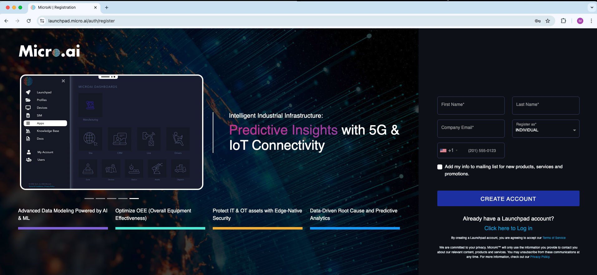
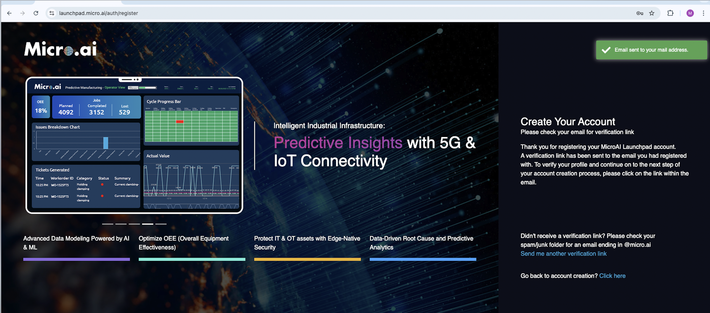
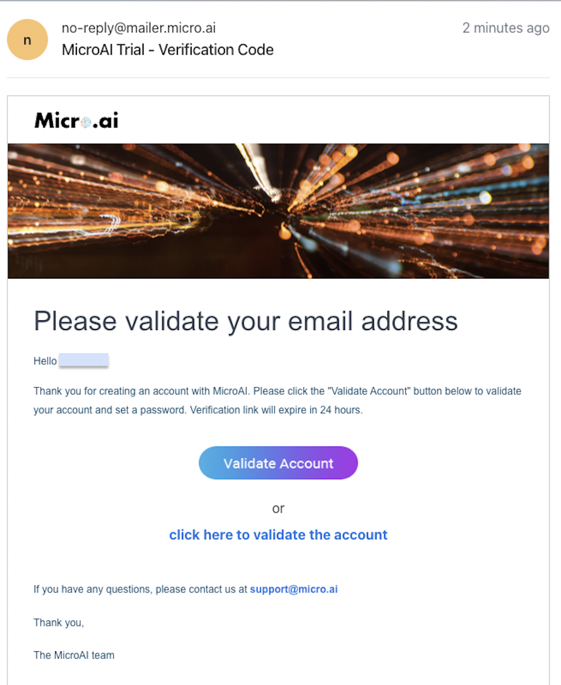
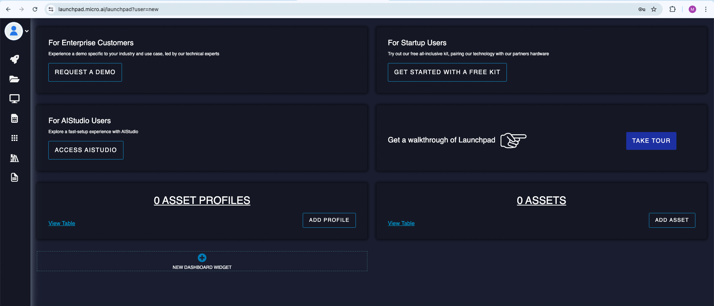
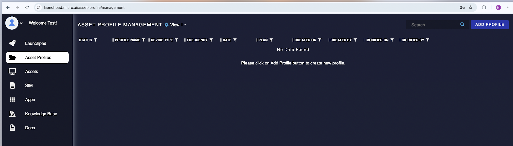
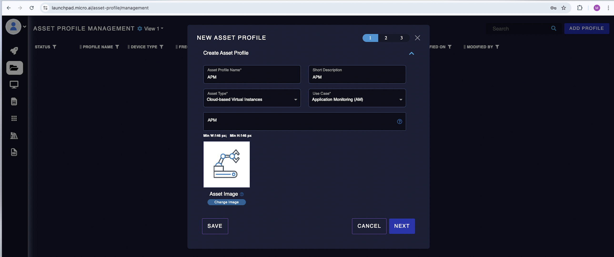
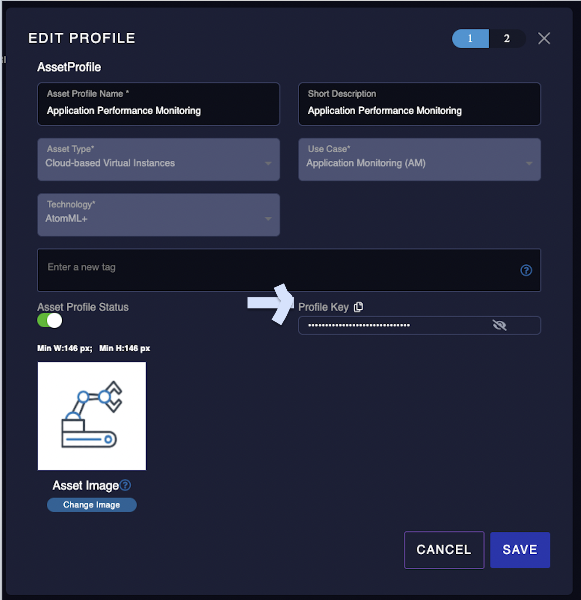

# Setup

Follow these steps to setup an account and onboard APM profile

### Step 1: Landing Page

Access the [Launchpad Landing Page](https://launchpad.micro.ai/auth/login) and Click on "Click here to Sign Up" to start the registration process

### Step 2: Registration

- Enter in required information

- After clicking on "Create Account"

- Check the email that was used during the registration process to continue with registration

- Click on Validate Account to setup password and continue with setup. After password has been set you will see a post login landing page

### Step 3: Onboarding APM profile

- Click on **Asset Profiles** to create a profile. This view allows you to see all your profiles and manage them here.

- Click on **ADD PROFILE** to start the process of creating a profile and select **Application Monitoring (AM)** from the Use Case drop down options. Follow the profile creation wizard to finish creating your APM profile

- Once done, you will see your profile listed on the **Asset Profiles** page. Click on the name to view your profile details. Here it will show you the *Profile Key* which is needed during APM Agent configuration

