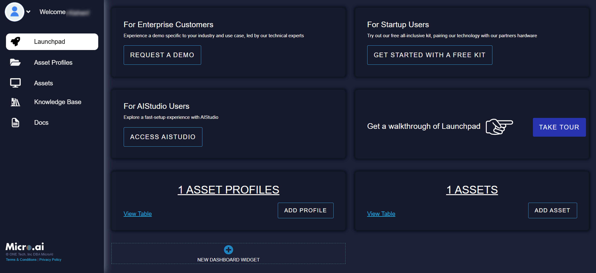
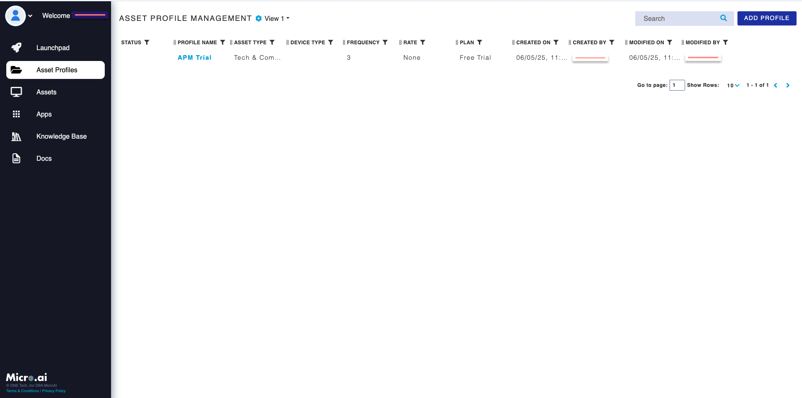

# Accessing Profile and Plan Details

Follow these steps to access and manage your profile and plan details on the MicroAI Launchpad.

### Step 1: Set Your Password

Access the [Launchpad Landing Page](https://launchpad.micro.ai/auth/login) and click on "Forgot Password."

Enter your email used during quick registration and follow the steps in the email to reset your password.

### Step 2: Log In to Launchpad

Once logged in, you will be greeted by the landing page.

### Step 3: Access Your Asset Profile

Click on **Asset Profiles** to view your current profile and plan details. Clicking on the **Edit (pencil icon)** allows you to view additional details.

